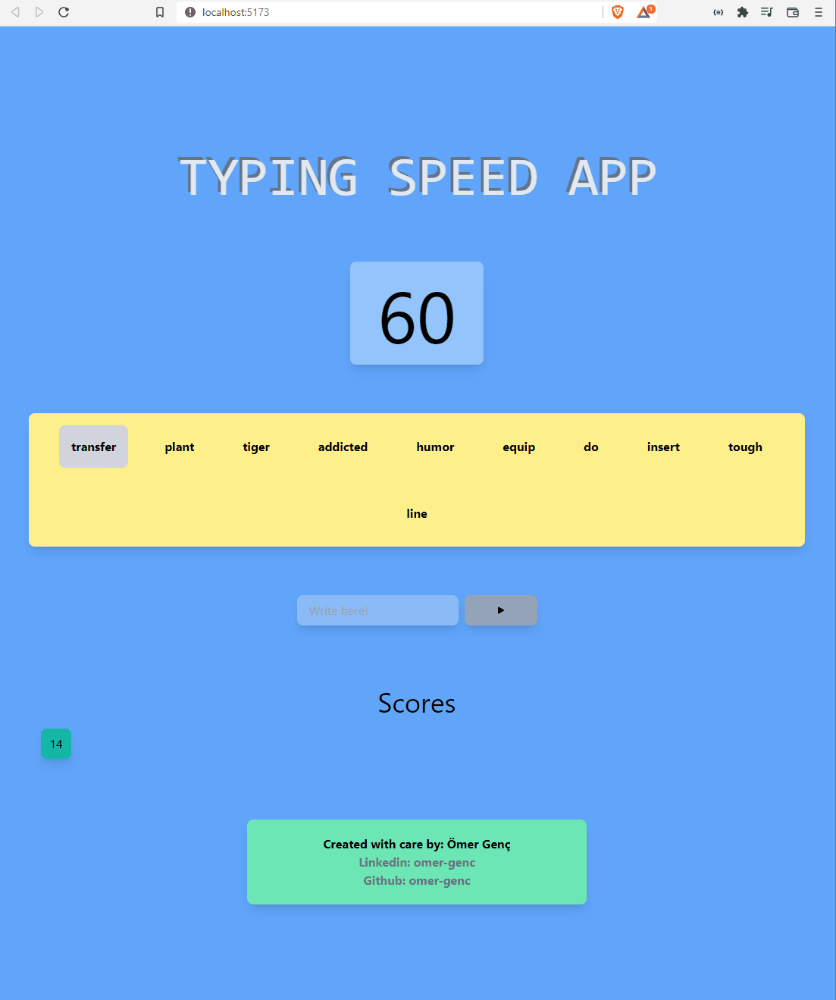

# Typing Speed App with React and MobX
[Live link](https://typing-speed-app-mobx.vercel.app/)
## Techs:
1. React
2. Vite
3. Type Script
4. Tailwindcss
5. MobX (State Management)

## Installation

1. Clone the repo
   ```sh
   git clone https://github.com/omer-genc/weather-app-recoil.git
   ```
2. Install project packages
   ```sh
   yarn
   ```

3. Run 
   ```sh
   yarn dev
    ```
## Screenshots


